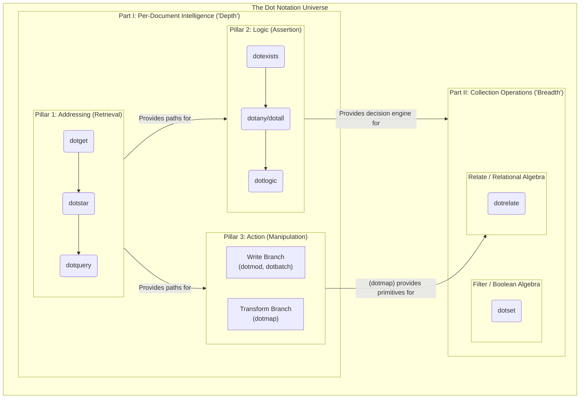

# The Dot Notation Universe: A Journey in API Design

It always starts with a simple problem. You have a nested dictionary or a JSON payload, and you need to get a value buried deep inside. You write `data['user']['contacts'][0]['email']` and you pray that no key or index is missing along the way, lest your program crash. This leads to brittle, defensive code.

The first, obvious solution is a helper function. This is where our story begins. What started as a single, humble function, `dotget`, evolved through a series of questions and insights into a complete, coherent, and powerful ecosystem for manipulating data structures. This is the story of that evolution—a journey in API design guided by the principles of purity, pedagogy, and the principle of least power.

## Part I: The Single Document - The Three Pillars of Intelligence

Mastering operations *inside* a single, complex document is the foundation of the entire ecosystem. We discovered that this "per-document intelligence" isn't a single path, but rests on three distinct pillars, each answering a different fundamental question.

### Pillar 1: The Addressing Layer (Retrieval)

This is the bedrock. It answers the question: **"WHAT is the value at a given location?"** Its tools are designed purely for finding and returning data.

  * **`dotget` (Exact Addressing):** The starting point. It retrieves a single value from a precise, known path (e.g., `"users.0.name"`).
  * **`dotstar` (Pattern Addressing):** Introduces the `*` wildcard to retrieve multiple values from a structural pattern (e.g., `"users.*.name"`).
  * **`dotquery` (Conditional Addressing):** The master addressing engine. It understands a complete path language, including conditional predicates (`[key=value]`) and descendant wildcards (`**`), to find and retrieve data from the most complex locations.

### Pillar 2: The Logic Layer (Assertion)

Once we can find data, the next question is not about the data's value, but its veracity. This pillar answers the question: **"IS a statement about this document true?"** Its output is always a boolean.

  * **`dotexists` (Simple Existence):** The simplest logical test. It takes a `dotget`-style exact path and returns `True` if it resolves to a value.
  * **`dotany` / `dotall` (Quantifiers):** This is the necessary next step for handling paths that return multiple values. It forces the user to be explicit about their intent. `dotany` checks if *at least one* returned value meets a condition, while `dotall` checks if *all* of them do.
  * **`dotlogic` (Compositional Logic):** The final stage. This is a full predicate engine that can compose the results of simpler checks using `AND`, `OR`, `NOT`. It can evaluate complex, self-referential assertions, such as checking if two different lists of values within the document have any intersection.

### Pillar 3: The Action Layer (Manipulation)

This pillar answers the question: **"HOW should this document be changed?"** It uses the Addressing Layer to find *where* to act. It is built on the principle of immutability—always returning a modified copy.

  * **The "Write" Branch (`dotmod`, `dotbatch`):** This branch is for direct mutation. `dotmod` provides the verbs for single changes (`set_`, `delete_`), while `dotbatch` provides the transactional capability to apply a sequence of changes atomically. Its output is the same document, modified (`Doc -> Doc`).
  * **The "Transform" Branch (`dotmap`):** This branch is for reshaping data. It takes a document and derives a new structure from it, such as a simplified "view model" for a UI. Its output can be of any shape (`Doc -> Any`).

## Part II: Collections of Documents - A World of "Breadth"

With a complete toolkit for single documents, we can now operate on collections, often represented as a stream of documents like in a **JSONL** file. This "Breadth" axis has two main pillars that use the per-document tools as their internal machinery.

### `dotset`: A Boolean Algebra for Collections

`dotset` filters a collection. It answers the question: **"Which documents in this collection match a set of logical rules?"** Its power comes from using the **Truth Pillar** as its decision engine for each document. A lazy, compositional `QuerySet` API allows for building complex queries efficiently.

```python
# Find all logs that are either a critical server error OR 
# a database call that was too slow, but EXCLUDING any from a known-buggy service.
logs = QuerySet(log_collection)

# This query is translated into a dotlogic AST and applied to each document.
results = logs.filter(
    Q(level="error", source="server") | Q(source="db", latency_ms__gt=500)
).exclude(
    service_name="buggy-service-alpha"
)
```

### `dotrelate`: A Relational Algebra for Collections

While `dotset` filters a collection, `dotrelate` transforms and combines multiple collections. It's the conceptual parallel to `dotmap`, but for datasets. It answers: **"How can these distinct collections be joined to create new, enriched data?"**

The core operation is the `join`, which combines documents from two collections based on a shared key.

```python
# users = [{"user_id": 1, "name": "Alice"}, ...]
# orders = [{"order_id": 101, "user_id": 2, "item": "Book"}, ...]

# Enrich each order with the name of the user who placed it.
enriched_orders = dotrelate.join(left=orders, right=users, on="user_id")

# -> [{"order_id": 101, ..., "name": "Bob"}, ...]
```

## The Big Picture: A Unified Architecture

This journey reveals a coherent universe of tools, underpinned by a dual API (programmatic for developers, declarative JSON/string for users) and a philosophy of clean, single-purpose components.

