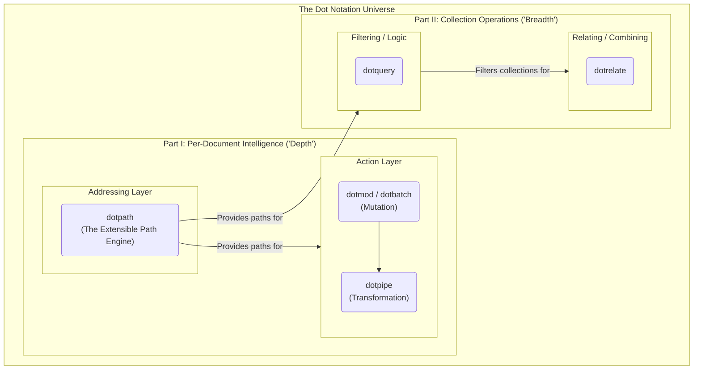

# The Philosophy of the Dot Universe

It always starts with a simple problem. You have a nested dictionary or a JSON payload, and you need to get a value buried deep inside. You write `data['user']['contacts'][0]['email']` and you pray that no key or index is missing along the way, lest your program crash. This leads to brittle, defensive code.

The first, obvious solution is a helper function. This is where our story begins. What started as a single, humble function, `dotget`, evolved through a series of questions and insights into a complete, coherent, and powerful ecosystem for manipulating data structures. This is the story of that evolution—a journey in API design guided by the principles of purity, pedagogy, and the principle of least power.

## Part I: The Single Document - The Axis of "Depth"

Mastering operations *inside* a single, complex document is the foundation of the entire ecosystem. We discovered that this "per-document intelligence" rests on two fundamental axes: **Addressing** (finding data) and **Action** (changing data).

### The Addressing Layer (`dotpath`)

This is the bedrock. It answers the question: **"WHAT is the value at a given location?"**

The entire addressing layer is consolidated into a single, powerful, and extensible engine: `dotpath`. It is not just a tool, but a simple, extensible machine. Its intelligence lives within small, self-contained, "expert" components (`PathSegment` classes) that can be added, removed, or replaced.

`dotpath` provides a rich, JSONPath-inspired syntax with features like:
- **Exact selectors**: `users.0.name`
- **Wildcards**: `users.*.name`
- **Slices**: `users[0:5]`
- **Recursive descent**: `**.name`
- **Filters/Predicates**: `books[?(@.price < 10)]`
- **Extensibility**: The engine can be taught new syntax, like fuzzy key matching, by registering new segment parsers.

All other tools in the ecosystem that need to find data (`dotquery`, `dotmod`, etc.) use `dotpath` as their internal engine.

### The Action Layer (Manipulation)

This pillar answers the question: **"HOW should this document be changed?"** It uses the Addressing Layer (`dotpath`) to find *where* to act. It is built on the principle of immutability—always returning a modified copy.

  * **`dotmod`**: Provides the verbs for direct, single modifications (`set`, `delete`).
  * **`dotbatch`**: Provides the transactional capability to apply a sequence of `dotmod` changes atomically.
  * **`dotpipe`**: Transforms a document's structure, reshaping it into something new (e.g., creating a simplified "view model").

## Part II: Collections of Documents - The Axis of "Breadth"

With a complete toolkit for single documents, we can now operate on collections, often represented as a stream of documents like in a **JSONL** file.

### `dotquery`: A Logic Engine for Collections

`dotquery` filters a collection. It answers the question: **"Which documents in this collection match a set of logical rules?"**

Its power comes from using `dotpath` to extract values and then applying logical conditions to them. It features a lazy, chainable `QuerySet` API that allows for building complex queries efficiently from the command line.

```bash
# Find all books that are either cheap (under 10) or written by "Tolkien", 
# and are in stock, then resolve the query to print the matching books.
$ dotquery query "(less price 10 or equals author 'Tolkien')" books.json \
  | dotquery and "equals in_stock true" \
  | dotquery resolve
```

### `dotrelate`: A Relational Algebra for Collections

While `dotquery` filters a collection, `dotrelate` transforms and combines multiple collections. It answers: **"How can these distinct collections be joined to create new, enriched data?"**

The core operation is the `join`, which combines documents from two collections based on a shared key. It also supports other relational operations like `union`, `diff`, and `project`.

```bash
# Enrich user data with their orders via a left join
$ dotrelate join --left-on="id" --right-on="user_id" --how="left" users.jsonl orders.jsonl
```

## The Big Picture: A Unified Architecture

This journey reveals a coherent universe of tools, underpinned by a dual API (programmatic for developers, declarative CLI for users) and a philosophy of clean, single-purpose components.


